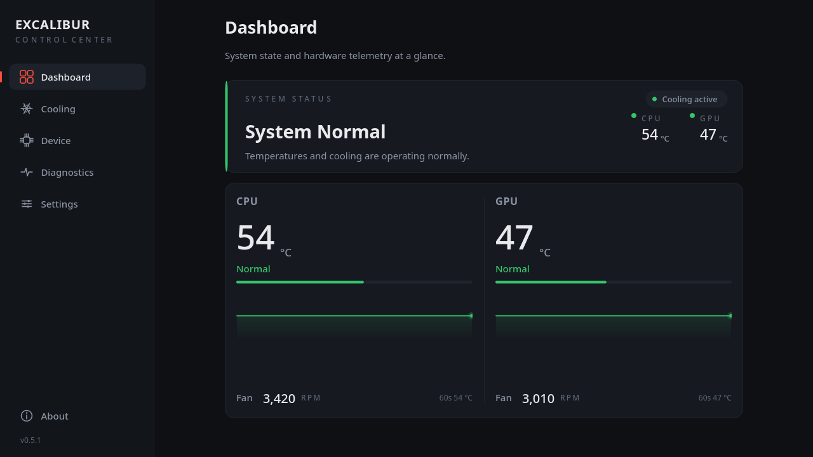
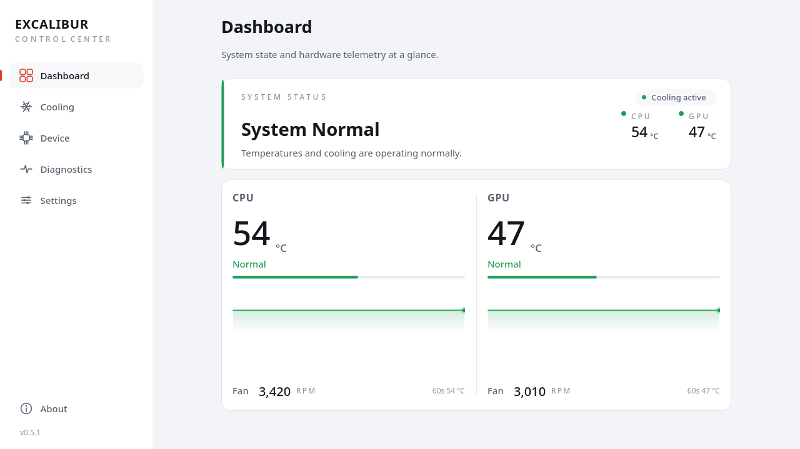
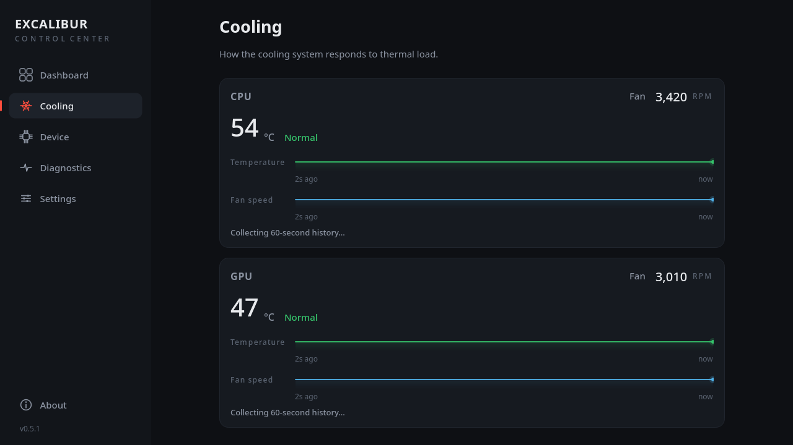
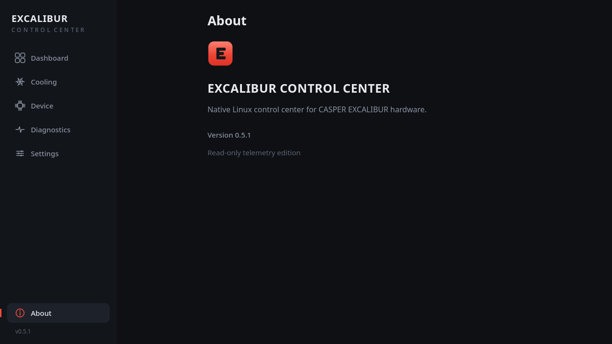

# EXCALIBUR Control Center

Native Linux hardware telemetry control center for CASPER EXCALIBUR laptops.

[](https://github.com/msahhf/excalibur-control-center/releases/latest)
[](https://github.com/msahhf/excalibur-control-center/actions/workflows/ci.yml)
[](LICENSE)
[](https://archlinux.org)



---

## Introduction

EXCALIBUR Control Center is a native Linux desktop application for monitoring CASPER
EXCALIBUR hardware. It provides real-time thermal and fan telemetry, system
information, diagnostics, configurable display preferences, and background operation
through the system tray.

The application is built with **Qt6** and runs entirely as an unprivileged user. The
integrated **`excalibur-wmi`** driver is a read-only hwmon kernel module delivered
through **DKMS**, so it is rebuilt automatically for each installed kernel.

## Features

| Area          | Capabilities                                                        |
| ------------- | ------------------------------------------------------------------- |
| Telemetry     | CPU / GPU temperature, CPU / GPU fan RPM                            |
| History       | 60-second temperature and fan history                               |
| Dashboard     | Live system state and thermal overview                              |
| Cooling       | Per-channel temperature, fan speed and history view                 |
| Device        | Hardware, firmware and kernel information                           |
| Diagnostics   | Runtime diagnostics and JSON export                                 |
| Settings      | Theme (System / Light / Dark), Celsius / Fahrenheit, refresh rate   |
| Background    | System tray, hide/show, single-instance runtime                     |
| Driver        | Integrated read-only `excalibur-wmi` DKMS module                    |

The current release focuses on read-only telemetry; hardware control features are
outside the current capability set.

## Screenshots

| Dashboard (dark) | Dashboard (light) |
| ---------------- | ----------------- |
|  |  |

| Cooling | About |
| ------- | ----- |
|  |  |

## Architecture

```
EXCALIBUR Control Center
        │
        ├── Qt6 GUI
        │
        ├── AppState / TelemetrySnapshot
        │
        ├── HwmonClient
        │
        └── excalibur-wmi   (read-only hwmon driver)
                │
              DKMS
```

The GUI reads from a single central telemetry state. Pages never access `sysfs`
directly — `HwmonClient` is the only telemetry read boundary — and the driver
exposes read-only hwmon telemetry.

## Installation

### Arch Linux / CachyOS

The package provides **both the application and the integrated DKMS driver**.

Download the latest release package and install it:

```bash
sudo pacman -U excalibur-control-center-0.5.2-1-x86_64.pkg.tar.zst
```

The application itself runs without root. Package installation and the DKMS
kernel-module lifecycle may use root.

### Build from source

Requirements: Qt6 Widgets, CMake, Ninja, and a C++17 compiler.

```bash
cmake -S gui -B gui/build -G Ninja -DCMAKE_BUILD_TYPE=Release
cmake --build gui/build
./gui/build/excalibur-control-center
```

The application starts without the driver and reports `Telemetry Unavailable` until
the module is available.

## Driver

The `excalibur-wmi` kernel module is packaged with the application and built through
DKMS for the installed kernel.

```bash
dkms status
sudo modprobe excalibur_wmi
cat /sys/class/hwmon/hwmon*/name     # excalibur_g870
```

## Hardware

```
CASPER EXCALIBUR G870 / NLXB 001
```

## Compatibility

| Kernel                 | Status                             |
| ---------------------- | ---------------------------------- |
| CachyOS `7.2.x`        | Verified                           |
| `6.18.x-lts`           | Driver API incompatibility         |

The driver targets the `wmidev_set_block` / `wmidev_query_block` kernel API. That
API is not present in the 6.18 LTS kernel, so the module does not build there.

## Telemetry

Telemetry values are displayed from the underlying hwmon readings without smoothing,
averaging or arbitrary clamping. What the hardware reports is what the application
shows.

## Diagnostics

The Diagnostics view presents the application's runtime state and can export it as
JSON. Exported temperatures are canonical Celsius values; unavailable readings are
represented honestly rather than as invented numbers. The export contains no
environment variables, credentials or personal data.

## Status

```
Current release : v0.5.2
Stage           : Public release / active development
Platform        : Linux
Primary target  : CachyOS / Arch Linux
License         : GPL-2.0-only
```

> AUR publication is pending account registration availability.

## License

GPL-2.0-only. See [LICENSE](LICENSE).

## Author

Muhammedşah Fidan — [@msahhf](https://github.com/msahhf)
